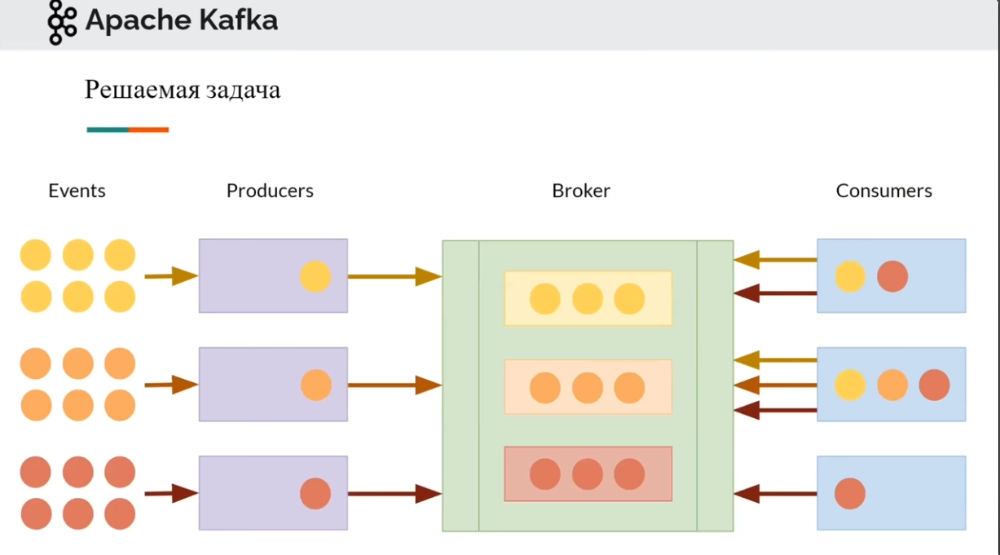
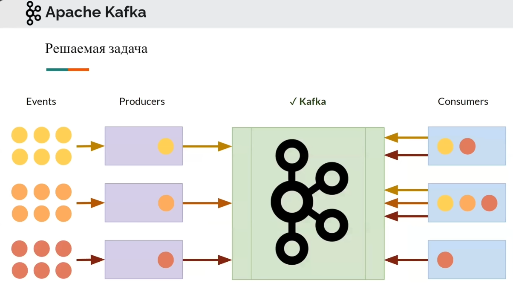
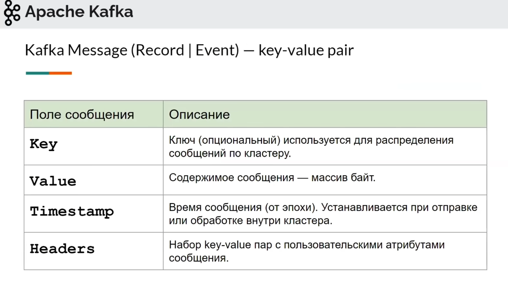
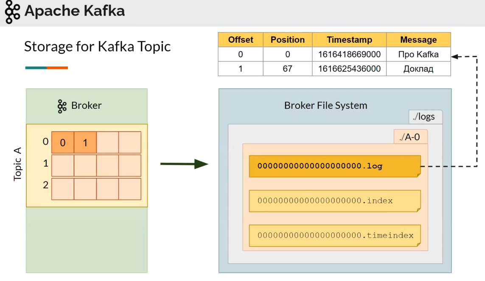
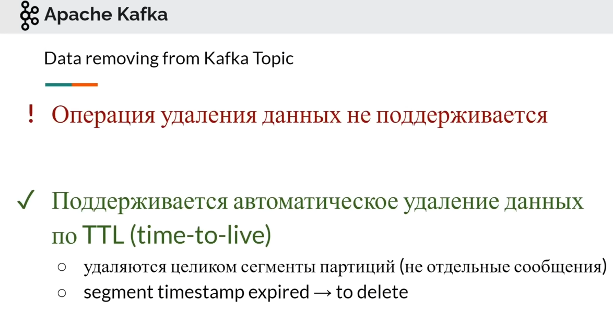
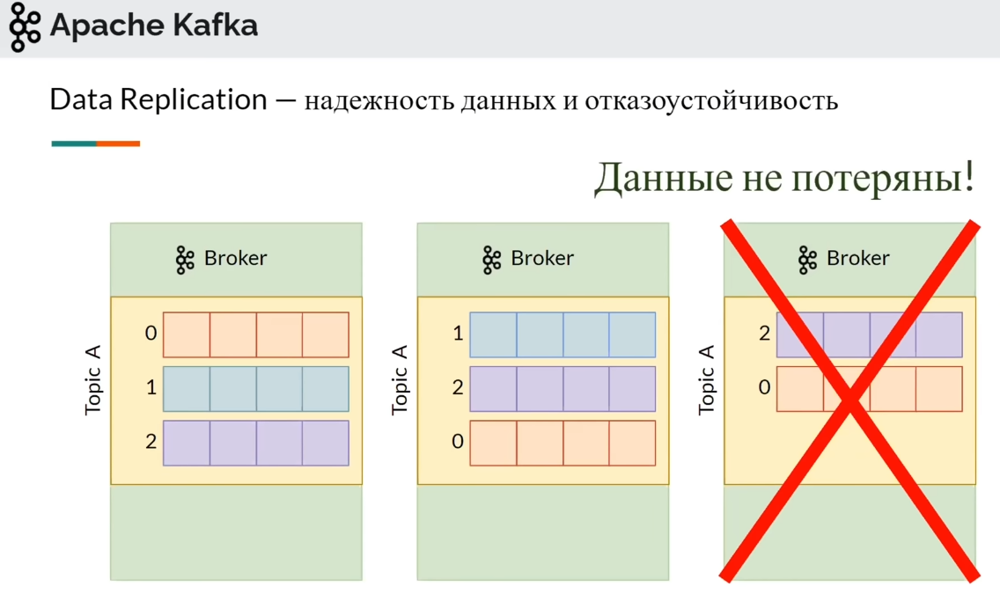

# Теория по Kafka:

## Общие сущности:
|||
| --- | ---- |
| Kafka (Кафка) | это брокер сообщений - распределенная платформа для обработки и передачи потоковых данных. Она предоставляет возможности для публикации, подписки и обработки потоковых данных в реальном времени |
| Producer (Производитель) | это клиент, который публикует (отправляет) сообщения в топики Kafka. Продюсеры генерируют данные и отправляют их на брокеры |
| Consumer (Потребитель)   | это клиент, который подписывается на топики Kafka и считывает (получает) сообщения из них. консьюмеры обрабатывают данные, полученные от продюсеров |
| Broker   (Брокер)        | это сервер, который хранит и управляет данными в Kafka. Брокеры принимают данные от продюсеров, хранят их на диске и предоставляют их консьюмерам |

---

## Кафка выступает в качестве брокера:

---

## Сущности Kafka:
|||
| --- | ---- |
| Kafka Broker (Kafka Server/Kafka Node) | это сервер, который принимает, хранит и выдаёт сообщения |
| Zookeeper (Координатор) | это кластер кафка - хранилище данных с состоянием кластера, конфигурации и мета-данные |
| Controller (специальный брокер) | обеспечивает консистентность данных |
| Kafka Message (Record/Event) | сообщение Kafka - это основная единица данных, которая передается и обрабатывается. Сообщение представляет собой упорядоченную последовательность байтов и может содержать любую информацию, которую продюсер отправляет в топик Kafka. Имеет структуру: `key-value pair` |
| Kafka Topic (Топик) | это набор данных, которые отправляет продюсер и будет считывать консьюмер (в том же порядке, котором были отправленны). RabbitMQ так не умеет (там отправка/приём идёт только по приоритету). Так же топик может иметь несколько партиций |
| Partition (Партиция) | находятся внутри топиков, ускоряет чтение и запись данных путём параллелизации |
| Broker File System | брокеровская файловая система - это место (broker), где хранятся данные топиков (папка `./logs`) |
| Offset (оффсет) | это номер сообщения в партиции |
| Producer (Производитель) | высокопроизводительный отправитель сообщений (клиент, который отправляет сообщения в топики Kafka. Продюсеры генерируют данные и отправляют их на брокеры |
| Consumer (Потребитель) | высокопроизводительный получатель  сообщений (клиент, который подписывается на топики Kafka и получает сообщения из них. консьюмеры обрабатывают данные, полученные от продюсеров) |
| Consumer Group (Группа потребителей) | несколько консьюмеров, которые работают вместе для обработки сообщений из одного или нескольких топиков. Каждое сообщение в топике будет обработано только одним консьюмером в группе |
| Lag (Задержка) | разница между последним доступным сообщением в партиции и текущим положением консьюмера. Задержка показывает, насколько консьюмер отстает от продюсера |
| Consumer Offsets (Консьюмеры оффсетов) | информация о прогрессе консьюмера в чтении сообщений из топиков. Консьюмеры оффсетов отслеживают, на каком сообщении они остановились, чтобы продолжить чтение с этой позиции при следующем запуске |

## Kafka Message/сообщение Kafka:

## Структура хранения топиков/партиций:

---

## Как удалить данные из топика?

---

## Репликация:

